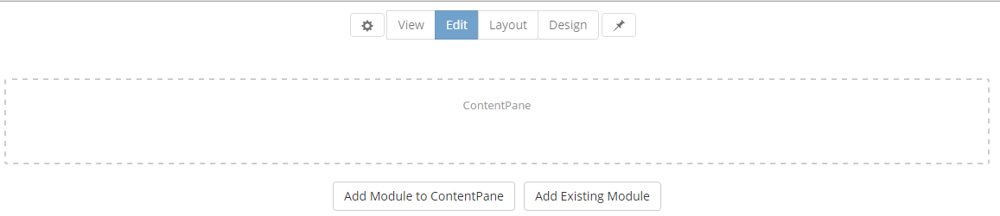
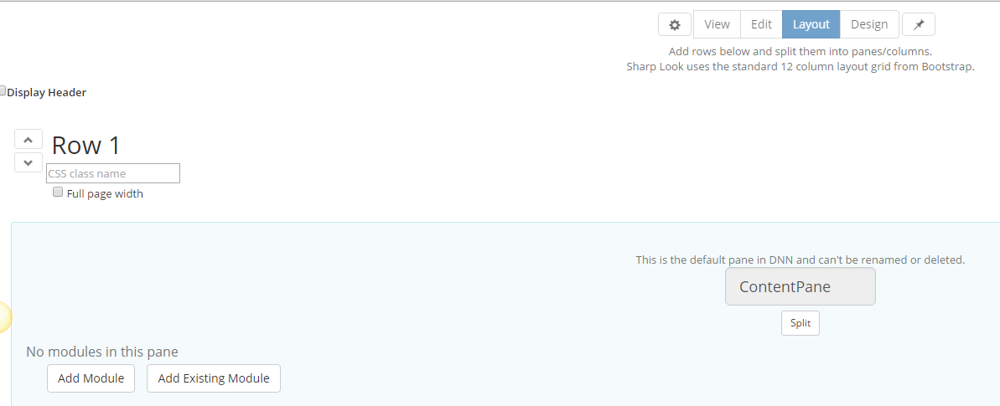
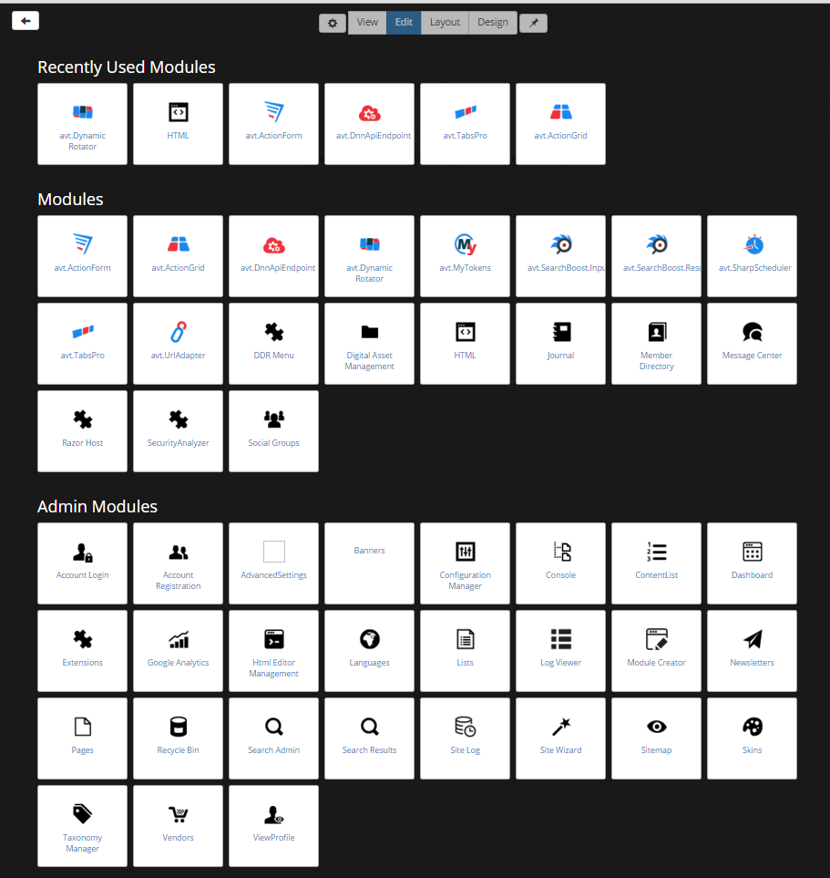

## Add Module Screen

**Summary**

* touch-friendly

* group modules by scope (regular modules, admin modules, host modules)

* remembers recently used modules

* in layout mode, add modules without reloading page
 
 
This page is shared between Edit and Layout Mode and like all other page and settings options, it is also touch-friendly. The useful part is that when you add a new module, the page does not reload; it remembers the recently used modules as well.
 
 

 
 

 
 
This panel opens whenever the Add module button is clicked, either from Edit mode or from Layout mode. All the modules installed on the instance and all the modules that come with DNN are displayed here. When a module is selected, the page loading process is skipped and the module is automatically added when selected. If you change your mind and you want to get back to the page you came from without adding any module, the back arrow in the left corner of the page redirects you to the Edit or Layout page, depending on the mode you've previously accessed.
 
 
