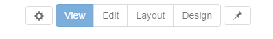
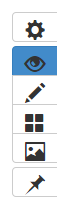
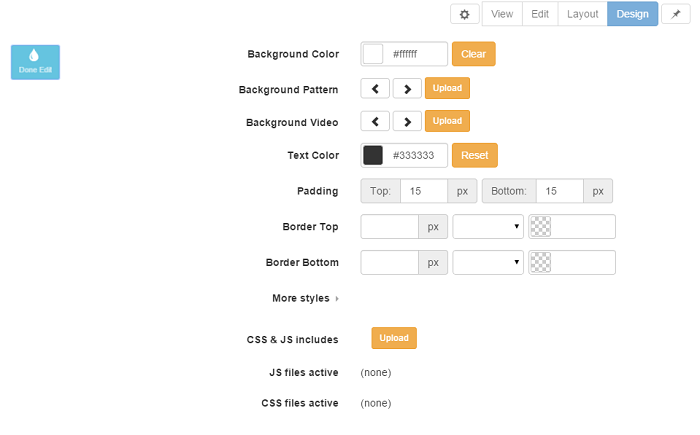
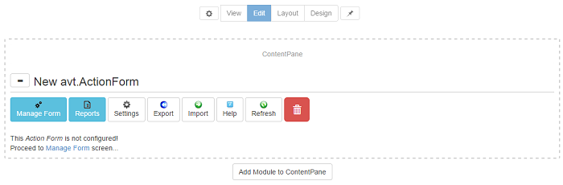
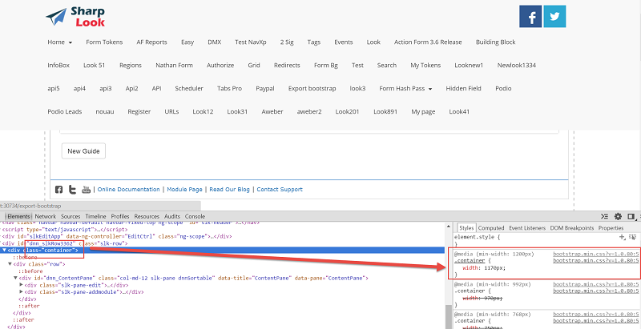

# Admin Controls

### Summary

* can be pinned on top or right

* can switch modes

* can open control panel
 
 
All DNN users are familiar with the Iconbar Mode found on all pages, which has the purpose of providing a single interface where authorized users can access pages and module management tools, shortcuts to the common administration tasks, and quick links to the Admin and Host consoles. 
 
 
The options from the DNN Iconbar Mode drop down list are also available in Sharp Look. Besides View, Edit, and Layout Sharp Look comes with a fourth option, Design, which is very useful in terms of customizing the design of the pages. Sharp Look also features two other useful buttons like the cogwheel button, which opens the Control Panel page and the Pin button which will change the arrangement of the Admin Controls to the right. All in all, Sharp Look comes in handy, you can create panes and layouts directly from the interface, you don't have to go on disk to build the skin files and mess with the data.

The Admin Controls can be displayed horizontally on top of the page, like in the image above or they can be moved on the right side of the page by using the pin button:

# Design Mode

Summary

optimized for designers
specifies settings per row such as background image, margins, borders, etc.
in design mode, modules are disabled
touch friendly
ability to upload background images - images are stored under \Portals\_default\Skins\SharpLook\static\bg\
everything is saved at the end when then Save button is clicked - you'll be warned if leaving the page without saving
In Design mode you can play with the colors, images, alignments and customize as many rows as you want. When accessing the Design mode, the Edit page and Edit Row buttons will be displayed, and once this buttons accessed, different options will be listed on the page which will provide you with the ability to change the appearance of the row/page. Amongst these design options, you'll find styling options like, the Background Color with which you can set the color either by using the color picker or by directly typing in the box the color hex code, the Background Pattern and Background Video from where you can select an image/video which is stored under \Portals\_default\Skins\SharpLook\static\bg - files like .png, .jpg, webm, mp4, ogg and many other image/video types are supported. 

The Text Color can also be set, the Top and Bottom Margin alignment can be defined in pixels and the Top and Bottom Border alignment. Once the width on the border/bottom is defined, you can select the style of the border from the listed ones: solid, dashed, dotted, double, hidden and afterwards you can set a color to make them distinct from the background. 

The CSS styles are used for a customized and personalized design - by using them you can edit the design per header/per page. On Page Design, the CSS and JS includes option where you can directly upload files to be integrated in the created page and last but not least, there's the More Styles option, which can also be found on each row, where you can define Less styles for the current elements, therefore, if you want to define the background color of the page you just have to type background-color: pink; or if you need to set a fixed height of a row you can type: height: 400px; or in case you need to define the margins of the rows/pages, you can type: margin-top: 10px; margin-left: 30px;. The styles set on a page are applied according to the following priority: the first priority is on the elements set on More Styles box, the second priority is on the settings from the row/page like Background color, text color, padding, border and the last priority is on the .css and .js uploaded files.

# Edit Mode

Summary
optimized for content editors
shows module actions and highlights panes
touch friendly module actions
touch friendly add module screen
The Edit mode is available for content editors, therefore, once decided what will be integrated on the page, and once the modules are customized and saved, you'll be able to proceed further with the Design option or with the View option in order to see the final front product. The Edit mode displays all module editing tools available to the current user.

On the Edit page, you'll find the Add New Module option, and once selected you'll begin the proceed by adding a new module on the current page and afterwards you can use the Edit module function, as well as the module's settings options. Once the "Add module to Content Pane" button is clicked, the Control modules page is displayed where all the installed modules are listed. If you change your mind and you want to get back on the Edit page, you can click on the Close button displayed on the right top of the page.

The module management page can be enlarged by clicking on the + icon from each module added on the page and displays all the module's buttons: Manage module, Settings, Export, Import, Help, Refresh, Delete and other buttons depending on the module added. You can use these options in order to manage the module, to move it to another page, to export the module's content and to import it on another page and even to permanently remove it from the page.

If you would like to edit the page's width, you can override it via CSS, as the page uses the default width specified in Bootstrap for the container class.

# Layout Mode

Summary
optimized for website owner
configure header (menu, search box, social buttons, registration controls, language selector)
define rows, a row can receive special design and hold up to 12 panes
resize panes
manage modules (add, delete, reorder) without reloading the page
Full width rows
everything is saved at the end when then Save button is clicked - you'll be warned if leaving the page without saving

The Layout mode displays the layout of the skin that is applied to the page and shows the location of modules on the page, the title and the modules actions menu of each module is shown and you can also find here the Add Module button, so if you arrive on the Layout page and you change your mind regarding what you've previously added on the Edit page, here you can modify, either by adding other modules or by removing the previously added ones. You can also split the page into more than one row, it's very useful for when you want to display, let's say, two grids on the page one next to another to compare the data. 

Display Header

On the Layout Mode page, you have the ability to configure the header with all its components: the menu, search box, social buttons, registration controls, language selector. 

Row Sections

The Full page width option, once checked, enlarges the rows from one side to another so that the page displays on the whole screen. To add a module on the page you just need to use the Add module button and when is necessary, you can split the pane into more than one. On each module, there is the Settings, Remove and Move option, click on the module to have access to these options. 
This view allows the users to quickly view and change the location of the modules from the page, like it was said before, it is also helpful when a module must be removed or moved but the module action menu cannot be accessed when the content is displayed. Talking about splitting the panes on the page, a row comes with one default pane which can be deleted or modified whenever it's the case. As a maximum limitation of how many panes you can have into one row, there's a limit of 12 panes, SharpLook uses the standard 12 column layout grid from Bootstrap. An interesting feature is the "Increase Size Left/Right" arrow which is very useful for arranging into the page the layout of the panes. 

Beware that in any Admin Mode screen, if you don't save the changes made before you navigate to another page, a pop up will be displayed informing you that the changes you've made are unsaved and it gives you two options "Leave this Page" and "Stay on this Page". 

Layout mode does not load the content of the modules added on the page, therefore in case there are errors on the modules they will not get displayed in Layout mode and as a tip, this mode is very useful when you want to access module settings or to remove them in case they are not displayed in edit mode. 

Layout along with Design settings can be saved as themes per Portal/Host. 

# View Mode

Summary
see exactly what non-admin users see
View mode is for end users, the page will display the final page with the module editing tools hidden, this option shows how the page appears to site visitors. Being responsive, the users will get to see it nicely on all mobile devices as well as on PC, in all sizes, on all browsers.
