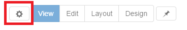
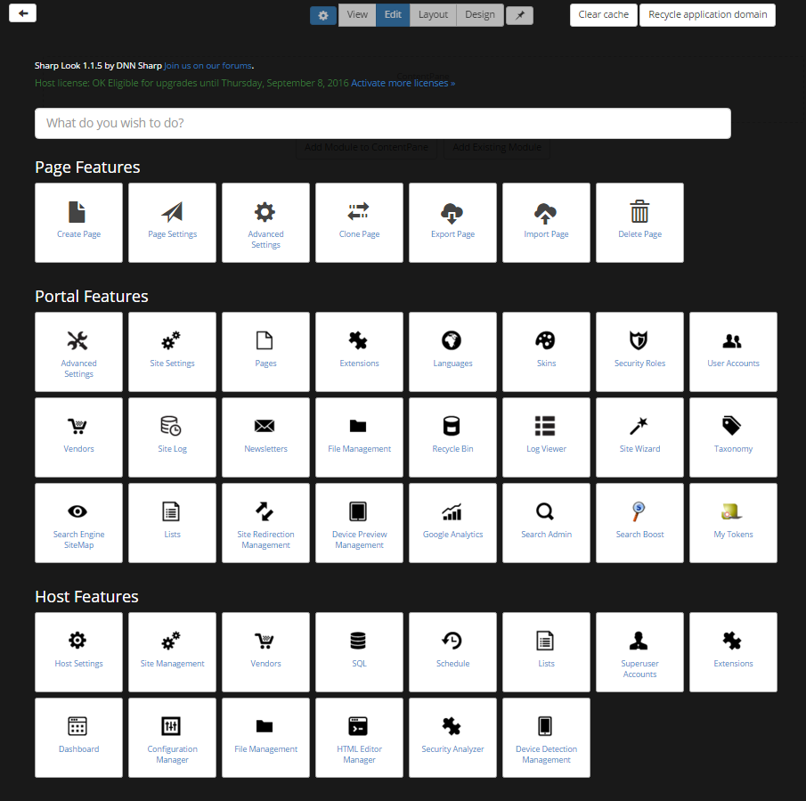

# Control Panel

* sections: page, portal, host based on permissions

* touch-friendly and responsive

* light forms for common tasks: create/update page, update portal settings, update host settings

* light forms have an Advanced Button to point to their DNN equivalent

The Control Panel enables Content Editors, Administrators and Super Users to access a range of page management tools and site administrative tasks. It can be accessed from the menu of a Sharp Look customized page by clicking on the first menu settings. A clean layout page is displayed, structured in several sections.

Control Panel Sections

The Control Panel is structured into four sections and displays large icons of the existing DNN Control Bar options, the ones which you find displayed in a single row of links with drop down associated menus across the very top of the web browser. Unlike the default DNN Control Bar display, the Edit Page option is displayed in the Admin Modes and once clicked it allows the users to change the view of the page and access the modules' settings. 

Feature Search Section

Talking about the sections from the Control Panel page, there is the Feature Search section with an autocomplete box which comes in handy with all the options displayed once some matching text is typed in. This functionality, once you get used with it, helps you in terms of time management and flexibility on the page because you can search directly for the settings which you need without loosing time to browse amongst all the other settings. Just type "Update" and here you go, three matching page tasks options will be displayed: Update current page; Change page permissions; Change page appearance. Let's not forget that you can also navigate and select suggestions using the keyboard.

Page Features Section

In this section different page settings from the DNN platform are grouped and listed, so you can find: Create Page option, Page Settings, Clone Page, Change Permissions, Export Page, Import Page, Delete Page.

Accessing the Create Page and the Page Settings option will act like a Settings Engine - you'll be redirected to the page where all the necessary options for creating or modifying a page are listed. If you want to create a page you'll be redirected to the Sharp Look form and not to the DNN one, only if you click on Advanced option you'll go the the DNN interface. On this create page form, you have the general settings like Page name, the possibility to make the page public and to include it in the menu, the location option which comes with the default After current page option and which can be changed, and the Layout Template which comes with the Host: Sharp Look default option, since you're on a page customized in Sharp Look. 

Another feature on the create page form is the Social section, it is strictly dependent on the Display Header and Enable Social options from the Layout page, for example, if a Twitter id is provided, then, once these options are all checked, the Twitter icon will be generated in the header on the page. On the create page form, there's a back arrow displayed on top so that you'll be able to get back on the Control Panel page. 

Portal Features Section

On Portal Features section you'll find the DNN Admin functions grouped together and listed in large icons, so basically, these are all the functions from the DNN Admin "Common Settings" and "Advanced Settings".   

Host Features Section

The Host Settings section displays the default DNN Host functions, all functions from the "Common Settings" and "Advanced Settings" tabs. 