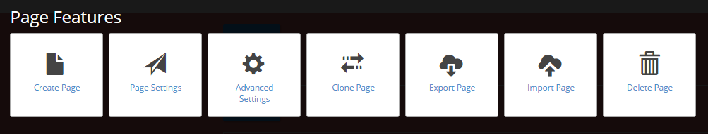
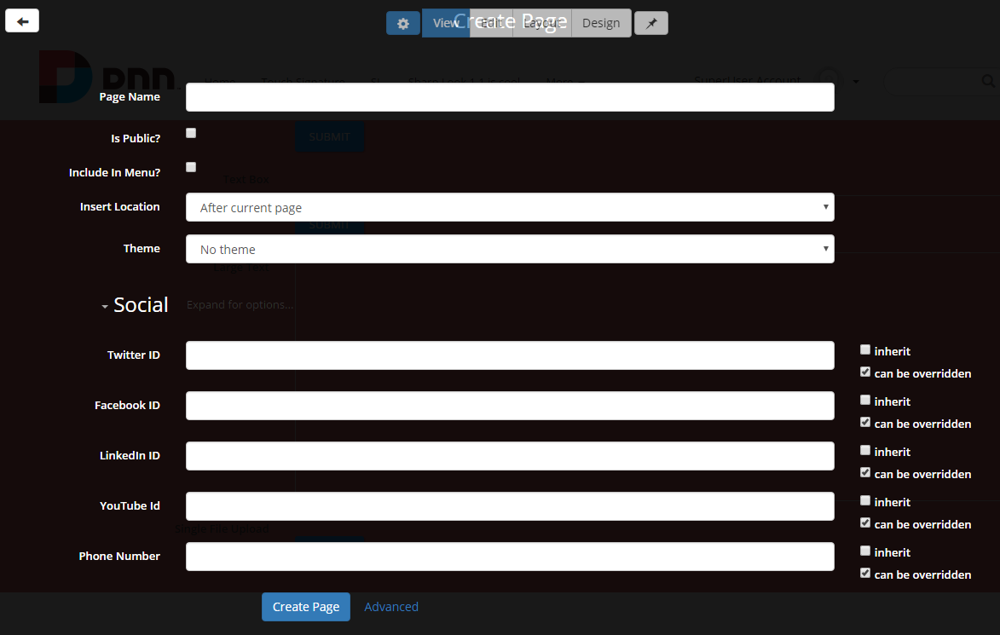
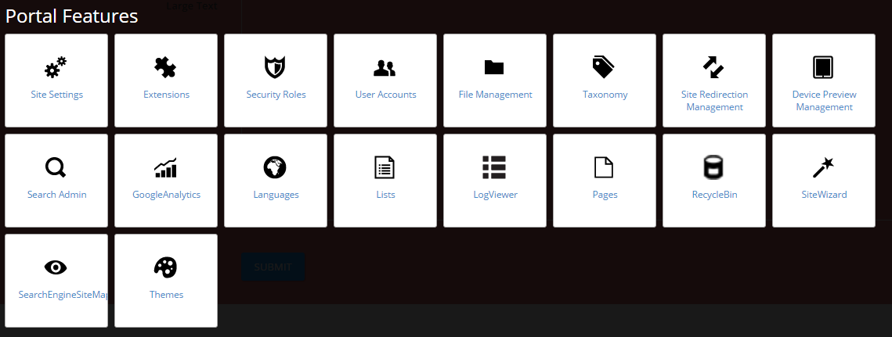
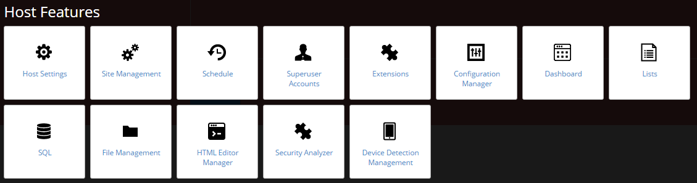

# Control Panel

* sections: page, portal, host based on permissions

* touch-friendly and responsive

* light forms for common tasks: create/update page, update portal settings, update host settings

* light forms have an Advanced Button to point to their DNN equivalent

The Control Panel enables Content Editors, Administrators and Super Users to access a range of page management tools and site administrative tasks. It can be accessed from the menu of a Sharp Look customized page by clicking on the first menu settings. A clean layout page is displayed, structured in several sections.
 
 

 
### Control Panel Sections

The Control Panel is structured into four sections and displays large icons of the existing DNN Control Bar options. Unlike the default DNN Control Bar, the Edit Page option is displayed in the Admin Mode and once clicked it allows the users to change the view of the page and access the modules' settings. 

 
### Feature Search Section

The Feature Search section uses an autocomplete box that comes in handy with all the options displayed once some matching text is typed in. This functionality helps you in terms of time management and flexibility on the page, as you can search directly for the settings you need without browsing all the other settings. You can also navigate and select suggestions using the keyboard.
 
### Page Features Section

In this section different page settings from the DNN platform are grouped and listed, so you can find: Create Page, Page Settings, Clone Page, Change Permissions, Export Page, Import Page, and Delete Page.
 
 

 
 
Create Page features general settings like Page name, the possibility to make the page public and to include it in the menu, and the location option.
 
 
Another feature on the create page form is the Social section. This is strictly dependent on the Display Header and Enable Social options from the Layout page; for example, if a Twitter id is provided the Twitter icon will be generated in the page header. The back arrow at the top of the page allows you to return to the Control Panel page. 
 
 

 
 
### Portal Features Section
 
On Portal Features section you'll find the DNN Admin functions grouped together and listed in large icons, so basically, these are all the functions from the DNN Admin "Common Settings" and "Advanced Settings" menu.
 
 

 
 
### Host Features Section
 
The Host Settings section displays the default DNN Host functions, all functions from the "Common Settings" and "Advanced Settings" tabs. 
 
 
