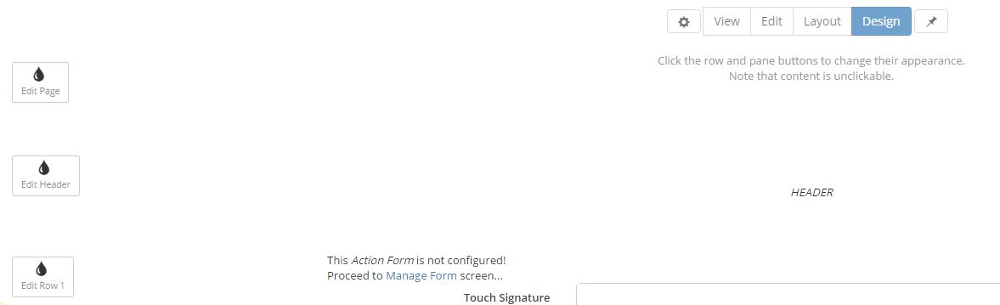
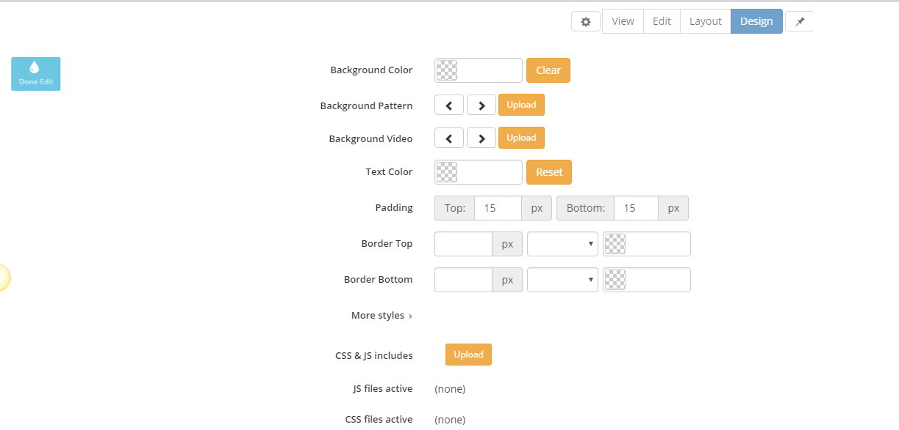

# Design Mode
### Summary

* optimized for designers

* specifies settings per row such as background image, margins, borders, etc.

* in design mode, modules are disabled

* touch friendly

* ability to upload background images - images are stored under \Portals\_default\Skins\SharpLook\static\bg\

* everything is saved at the end when then Save button is clicked

In Design mode you can play with the colors, images, and alignments and customize as many rows as you want. When accessing the Design mode, the Edit Page, Edit Header, and Edit Row buttons are displayed.
 
 

 
 
The Background Color can be altered either via the color picker or by directly typing in the box the color hex code. The Background Pattern and Background Video images/videos are stored under \Portals\_default\Skins\SharpLook\static\bg.Formats like png, jpg, webm, mp4, ogg, and many others are supported. 
 
 

 
 
The CSS styles are used for a customized and personalized design - by using them you can edit the design per header/per page. The "CSS and JS includes" option allows uploaded files to be integrated in the created page and last but not least, there's the More Styles option, which can also be found on each row, where you can define Less styles for the current elements. 
 
 
If you want to define the background color of the page you just have to type background-color: pink; or if you need to set a fixed height of a row you can type: height: 400px;. In case you need to define the margins of the rows/pages, you can type: margin-top: 10px; margin-left: 30px;. 
 
 
The styles set on a page are applied according to the following priority: the first priority is on the elements set on More Styles box, the second priority is on the settings from the row/page like Background color, text color, padding, and border, and the last priority is on the .css and .js uploaded files.