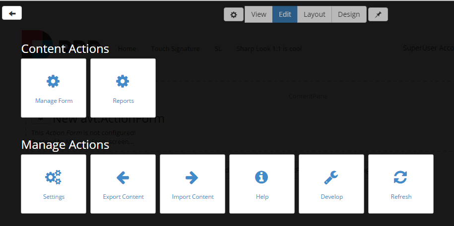

# Edit Mode

### Summary
* optimized for content editors

* shows module actions and highlights panes

* touch-friendly module actions

* touch-friendly add module screen
 
 
The Edit mode is suitable for content editors; once you decide what to integrate on the page and the modules are customized and saved, you'll be able to proceed further with the Design or with the View option in order to see the final front product. The Edit mode displays all module editing tools available to the current user.
 
 
On the Edit page you find the Add New Module option. After a module is added to the page, you can proceed with editing it. Clicking "Add module to Content Pane" opens the module Control panel where all installed modules are listed. If you change your mind and you want to get back to the Edit page, you can click on the Close button displayed in the top-right corner.
 
 
The module management page can be enlarged by clicking on the cogwheel icon of each module on the page. This opens a new window that reveals the actions that can be taken with regards to the module: Manage module, Settings, Export, Import, Help, Refresh, Delete, and other buttons depending on the module. You can use these options in order to manage the module, to move it to another page, to export its content and to import it on another page, and even to permanently remove it from the page.
 
 

 
 
If you would like to edit the page's width, you can override it via CSS, as the page uses the default width specified in Bootstrap for the container class.
 
 

