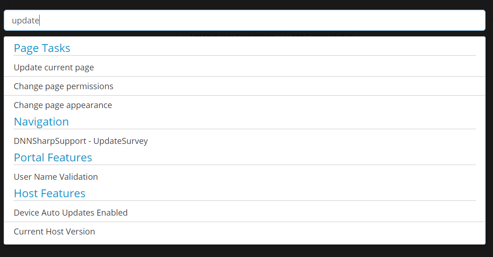

# Feature Search

### Summary

* at the top of control panel

* also on key press inside the page

* open architecture, can be extend through config files and/or custom assemblies

* integrates with DNN to pull localization

* navigate and select suggestions using keyboard keys

Search panel is displayed whenever something is typed on the page in View mode or you can activate it by opening Control Panel page by clicking on the first button under Admin Controls options.
 
 

 
 
Unlike all our other modules that keep their files under \DesktopModules, the files of Sharp Look can be found under Portals\_default\Skins\SharpLook. Sharp Look has a config engine where you can upload other .json files in order to modify/add the suggestions displayed on search, or you can modify the existing .host-settings.json.config file to extend the suggestions list. 
 
 
You can also extend the suggestions list programmatically in custom assemblies, there's this type string class on line 5 in .host-settings.json.config file which knows to use the defined settings in order to produce a new suggestion, so you can implement your own code if you want to produce different suggestions.

Regarding the localization, Sharp Look integrates with DNN to pull localization, so, if a setting from Host Settings is localized, the engine will search in the DNN's .resx localization file and it takes the key.

 "Title": { "file": "/DesktopModules/Admin/HostSettings/App_LocalResources/HostSettings.ascx.resx", "key": "plHostDefaultDocType.Text", "default": "Fallback Skin Doctype" }