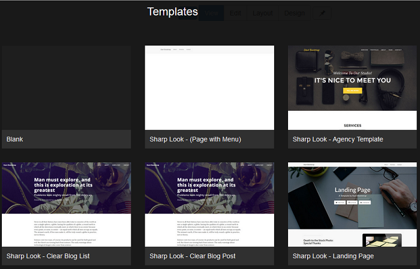
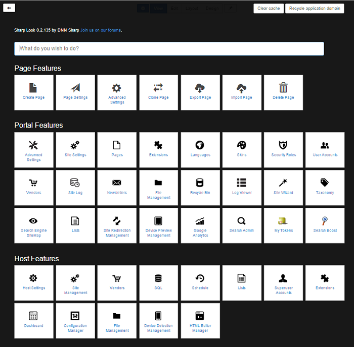

# Getting Started

**How to use Sharp Look**

To sum up, Sharp Look is a CMS framework that redefines how sites are created and managed by replacing the DNN administration controls with a touch-friendly interface. It gives you the possibility to edit the design of your web pages, besides other options like View, Edit, and Layout. 
 
 
Sharp Look lets you control your portal’s styling; it changes the entire DNN interface by integrating as a skin and you can set it for a page or for the entire site. Basically, we can say that Sharp Look is an engine. The purpose of this module is to get rid of as much UI as possible - we've built a DNN light distribution using this engine on top of DNN; in other words, we've refactored DNN a little to be able to get rid of the entire UI. 
 
 
**How to work with Sharp Look**
 
 
There are two basic ways to integrate Sharp Look on your site: you can set your site with Sharp Look skin from Admin > Site Settings or from Host > Site Settings, or you can use Sharp Look as skin per page.
 
 
**How to create a customized page with Sharp Look**
 
 
Access the Pages option from menu, click on Add New Page, fill in all the required fields, access Advanced Settings and set Host: SharpLook on both Appearance options - on Page Skin and on Page Container - and finally, click on the Add page button. 
 
 
Instead of a white canvas, all the existing page templates will be displayed and you'll have to choose the one you prefer. You can select the Blank option if you need to get started with a white canvas, or some other templates that come with the Sharp Look.
 
 

Once the template is selected, you'll get redirected to the newly-created page. You can use the Admin Control bar to further customize the page.
 
 
The cogwheel icon button enables the Control Panel page where the available features per page/portal/host are displayed, along with an advanced Feature Search box useful to navigate between options and Clear Cache & Recycle application domain buttons.
 
 

View mode button which is destined for the end-users, in View mode, the page displays the final page after it was designed and edited according to the specifications.

Edit mode which is created for content editors who'll deal with the integration of the module per page and their customization (here all the module's settings options get displayed when you click on the + icon: Manage module, Settings of the module, Export/Import options, Help, Refresh and also Remove).

Layout mode which gives the ability to create rows and panes where the modules will be added into, you can also add modules here, so you're not strictly dependent on Edit mode to do this, and from Layout mode you can also control the Menu and the Header options. 

Design mode offers the possibility to customize the whole page by accessing the Edit page button - here, besides playing with colors, video, images, border sizes, you can also set Less styles in a certain format (e.g. background-color: red;) and you can also directly upload .css and/or .js files. There are also the Edit Row options which will let you customized each row if you need an interactive design. 

Pin button - the last option in line, has the purpose of rearranging the Admin Control bar to the right side of the page - the buttons will change to icons and whenever in doubt you can mouse over them to see what you have to click in order to access the mode you need. 