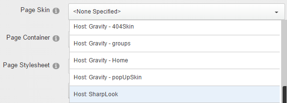
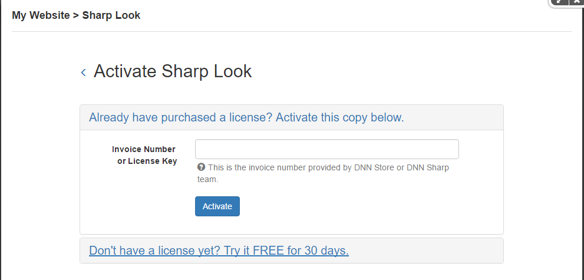
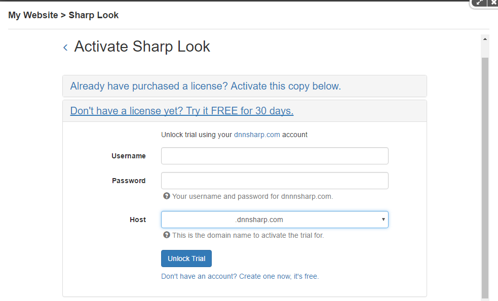
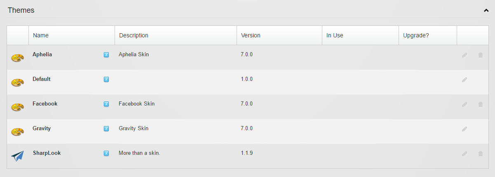

# Installation

**How to install Sharp Look**

Sharp Look can be downloaded from our download page, and since you access this page, you can also check the change log to get in touch with all the new and improved features of this module.
 
 
In order to install Sharp Look on your DNN website you have to follow the same steps with which you got familiar until now, and which are listed bellow - just to be sure nothing is skipped:
 
* Log into your DNN site as Administrator;

* Select Extensions option from Host menu;

* Click on the Install Extension Wizard button;

* On the Upload New Extension Package page, click on Choose File button;

* Select the Sharp Look package you previously downloaded on your hard drive, then click on Open;

* Click on Next and follow the installation wizard.
 
 
That's all you have to know about installing the module. Keep in mind that we're dealing with a customization module and if you want to make sure the installation was successful, check whether the module was saved on the Skins section of the Host/Extensions page.  
 
**How to use Sharp Look**
 
 
After the module has been successfully installed, you can use it as skin on the desired pages or as skin for the entire site. The steps are as follows: 
 
 
To set the skin of a page to Sharp Look you have to access Page Settings > Advanced Settings > Page Skin (and optionally Page Container) > select Host: SharpLook > click on Update Page > then proceed to activating the trial/license;
 
 

 
 
To set the skin of the site to Sharp Look you have to access Admin > Site Settings > Appearance > Site Skin and Edit Skin have to be set on Host: SharpLook, and/or you can do it from Host > Host Settings > Appearance, then proceed with the activation of the trial/license.
 
 
**Adding a module and editing a Sharp Look page**
 
 
After you create a page with Sharp Look you have the possibility to add modules on the page either in Edit mode or in Layout mode. In Edit mode you have access to other modules' options like module settings, export, import options, and in Layout mode there is only the remove module option. By clicking on the Add module button, a panel with all the installed modules is displayed from where you can choose the ones you need to use on the page. 
 
 
**Activate License/Trial**
 
 
When you add Sharp Look as page skin for the first time, you are prompted to enter your Invoice Number or License Key in order to activate the module. 
 
 

 
 
**The 30-day trial** is unlocked using your dnnsharp.com account.
 
 

 
 
In previous versions there was the ability to activate Sharp Look by using a keyfile. This option has been removed as of 1.1.
 
 
**How to remove Sharp Look **
 
 
To uninstall Sharp Look from your DNN instance you first have to remove the skin from every page it's used on and then access Host > Extensions > Themes. Do note that the delete button is not available if Sharp Look is in use.
 
 
