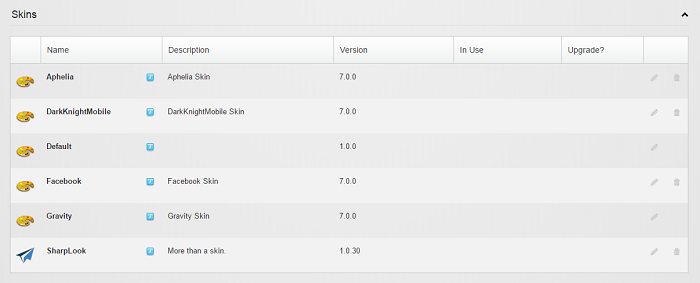

# Installation

**How to install Sharp Look**

Sharp Look can be downloaded from our download page, and since you access this page, you can also check the change log to get in touch with all the new and improved features of this module.

In order to install Sharp Look on your DNN website you have to follow the same steps with which you got familiar until now, and which are listed bellow - just to be sure nothing will be skipped:

* Log into your DNN site as Administrator;

* Select Extensions option from Host menu;

* Click on the Install Extension Wizard button;

* On the Upload New Extension Package page, click on Choose File button;

* Select the Sharp Look package you previously downloaded on your hard drive, then click on Open;

* Click on Next and follow the installation wizard
 
 
That's all you have to know about installing the module. Keep in mind that we're dealing with a customization module and if you want to make sure the installation was successful, check whether the module was saved on the Skins section of the Host/Extensions page.  
 
**How to use Sharp Look**
 
 
After the module has been successfully installed, you can use it as skin on the desired pages or as skin to the whole site. The steps are as follows: 

1. to set the skin of a page to Sharp Look you have to access Page Settings > Advanced Settings > Page Skin (and optionally Page Container) > select Host: SharpLook > click on Update Page > then proceed to activating the trial/license;

2. to set the skin of the site to Sharp Look you have to access Admin > Site Settings >  Appearance > Site Skin and Edit Skin have to be set on Host: SharpLook, and/or you can do it from Host > Host Settings > Appearance, then proceed with the activation of the trial/license.

**Adding a module and editing a Sharp Look page**

After you create a page with Sharp Look skin you have the possibility to add modules on the page either in Edit mode or in Layout mode, therefore, in Edit mode you'll have the other modules' options like, module settings, export, import options, and on Layout mode you'll have only the remove module option. By clicking on the Add module button, a panel with all the installed modules will be displayed from which you can choose the ones you need to use on the page. 

**Activate License/Trial**

Sharp Look comes with two types of packages, on one hand there's the simple package which contains only the SharpLook build, on the other hand, there's the Sharp Look Lead Pages package which comes with Sharp Look build and Action Form. The last package has a version of Action Form which will be activated at the same time with the activation of Sharp Look.

Regarding the licensing, with the release of Sharp Look we've implemented a new licensing UI and functionality, basically, whenever you install SharpLook on the site and set it as skin per site or per page you'll be asked to activate the module, these steps are the same as for other modules, but the activation page will look different in terms of UI and both activation options will be available.

The Activate license option allows to activate the product with the Invoice number and with a Key which can be downloaded from the DNN Store product downloads and then upload the .xml file in the Key File box. Another important feature is that once you set the Host on which you want to activate the license, then automatically your license will be activated and will cover all the localized domains, for example, if I have a site like site.com with localized domains like site.fr; site.co.uk, then, once the license of Sharp Look module is activated on site.com domain, then all the other localized domains will have the module activated (we aim to also implement this feature for all our modules).  

The important thing to know is that when you install Sharp Look Lead Pages package, then, the activation of the Sharp Look's license will trigger the activation of the license of Action Form and in bin folder there will be one license file, DnnSharp.lic which will contain the activation key for both modules.

**Activate 30 days Trial** basically works with the username and password of your dnnnsharp.com account, and the Host option will work the same as the one from License activation section, whenever there are localized domains, once the trial is activated for one domain, on all the other localized domains Sharp Look module will be activated. This options is also available for the Sharp Look Lead Pages package. 

**How to remove Sharp Look **

In order to remove Sharp Look from your DNN instance, first, you have to make sure you've removed all the Sharp Look skins and containers from all the pages and then access Host > Extensions > Skins and you'll see that the remove button is displayed besides the edit button. 

