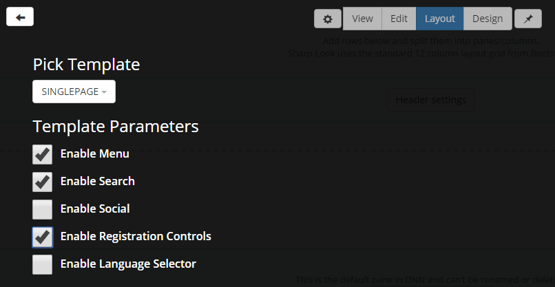
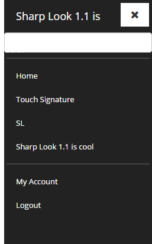
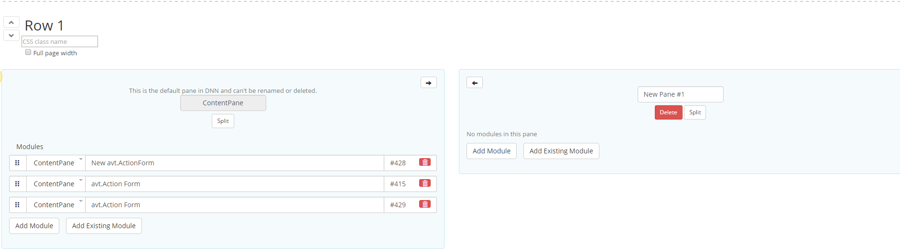

# Layout Mode
### Summary

* optimized for website owner

* configure header (menu, search box, social buttons, registration controls, language selector)

* define rows, a row can receive special design and hold up to 12 panes

* resize panes

* manage modules (add, delete, reorder) without reloading the page

### Full width rows

Everything is saved at the end when then Save button is clicked and a warning message is displayed if you attempt to leave the page without saving the changes. 
 
 
The Layout mode shows where the modules are positioned on the page. Besides module title and module actions, the Add Module button is also present, saving you the trouble of going back to Edit mode to make any changes to the page content. You can also split the page into more than one row - very useful for when you want to display, say, two grids on the page one next to another to compare the data. 
 

### Display Header

On the Layout Mode page, you have the ability to configure the header with all its components: the menu, search box, social buttons, registration controls, language selector. Release 1.1 brings forth a new and improved Header section, as illustrated below.
 
 

 
 
A Corner menu has also been added, which fixes HTML tags of H2 appearing as a submenu item.
 
 

 
### Row Sections

The Full page width option, once checked, enlarges the rows from one side to another so that the page displays on the entire screen. To add a module on the page you just need to use the Add module button and when necessary, you can split the pane into more than one. Each module has Settings, Remove, and Move options. 
 
 
This view allows users to quickly view and change the location of the modules on the page. Speaking of splitting the panes on the page, a row comes with one default pane that can be deleted or modified whenever the case. With regards to how many panes you can have in one row, there's a limit of 12 panes, as Sharp Look uses the standard 12-column layout grid from Bootstrap. An interesting feature is the "Increase Size Left/Right" arrow, which is very useful for arranging the layout of the panes. 
 
 

 
 
As of Sharp Look 1.1, drag and drop functionality is available for modules within the same pane.
 
 
Beware that in any Admin Mode screen, if you don't save the changes made before you navigate to another page, a pop up will be displayed informing you that the changes you've made are unsaved. You can either "Leave this Page" and "Stay on this Page". 
 
 
Layout mode does not load the content of the modules, so in case there are errors with the modules, they are not displayed.
 
 
Layout and Design settings can be saved as themes per Portal/Host.