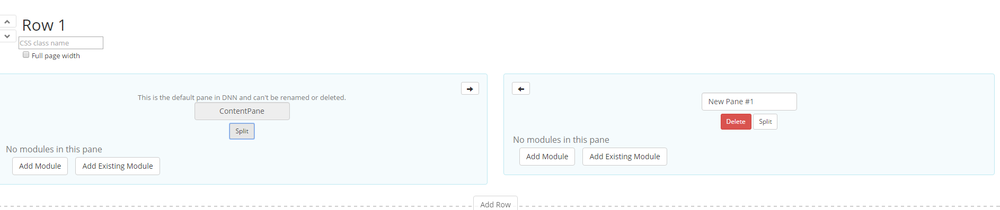

# Layout Mode

Summary
optimized for website owner
configure header (menu, search box, social buttons, registration controls, language selector)
define rows, a row can receive special design and hold up to 12 panes
resize panes
manage modules (add, delete, reorder) without reloading the page
Full width rows
everything is saved at the end when then Save button is clicked - you'll be warned if leaving the page without saving

The Layout mode displays the layout of the skin that is applied to the page and shows the location of modules on the page, the title and the modules actions menu of each module is shown and you can also find here the Add Module button, so if you arrive on the Layout page and you change your mind regarding what you've previously added on the Edit page, here you can modify, either by adding other modules or by removing the previously added ones. You can also split the page into more than one row, it's very useful for when you want to display, let's say, two grids on the page one next to another to compare the data. 

Display Header

On the Layout Mode page, you have the ability to configure the header with all its components: the menu, search box, social buttons, registration controls, language selector. 

Row Sections

The Full page width option, once checked, enlarges the rows from one side to another so that the page displays on the whole screen. To add a module on the page you just need to use the Add module button and when is necessary, you can split the pane into more than one. On each module, there is the Settings, Remove and Move option, click on the module to have access to these options. 
This view allows the users to quickly view and change the location of the modules from the page, like it was said before, it is also helpful when a module must be removed or moved but the module action menu cannot be accessed when the content is displayed. Talking about splitting the panes on the page, a row comes with one default pane which can be deleted or modified whenever it's the case. As a maximum limitation of how many panes you can have into one row, there's a limit of 12 panes, SharpLook uses the standard 12 column layout grid from Bootstrap. An interesting feature is the "Increase Size Left/Right" arrow which is very useful for arranging into the page the layout of the panes. 

Beware that in any Admin Mode screen, if you don't save the changes made before you navigate to another page, a pop up will be displayed informing you that the changes you've made are unsaved and it gives you two options "Leave this Page" and "Stay on this Page". 

Layout mode does not load the content of the modules added on the page, therefore in case there are errors on the modules they will not get displayed in Layout mode and as a tip, this mode is very useful when you want to access module settings or to remove them in case they are not displayed in edit mode. 

Layout along with Design settings can be saved as themes per Portal/Host. 