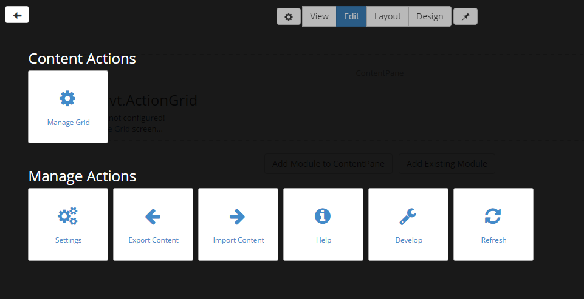
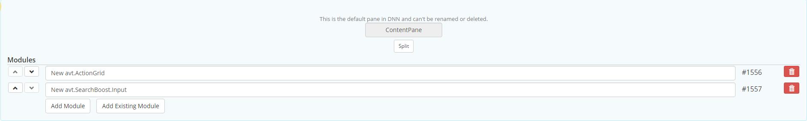

# Module Management

### Adding modules on a page
 
Modules can be added on a page with Sharp Look either in Edit mode or in Layout mode. Layout mode is preferred when there are errors generated on the modules and they cannot be accessed directly in Edit mode. To add a module, you just have to click on the Add module button and when the Modules panel is displayed choose which module you want to display. 

Edit a module

Once a module is added on a pane, you have to access its settings by going to the Edit mode and by clicking on the + icon and all the module's settings, including the manage module option will get displayed:

Ordering modules on page

In order to change the position of a module on a page, either on another row or on another pane, you have to access the Layout mode and use the Move module button which gets displayed and is accessible once you've added more panes or rows on the page besides the default Content Pane option.

Export and Import modules

These two options are available per each module and can be found on the Edit page once the + icon has been clicked and enlarged. You can use the export and import options in order to use the content of a module on other pages not being forced to remake the same module from scratch on all the pages you want to add it to.  

Removing module

The delete module option is available on both Edit and Layout pages along with module's Settings option.