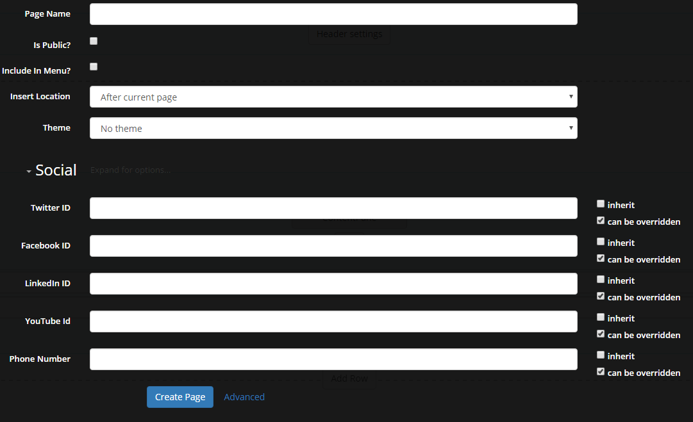

# Page Management

Create page

In order to create a page when Sharp Look is set as skin on the site, you have to open the Control Panel page by clicking on the first icon button from the Admin Controls bar and to click on Create Page icon button from Page Features. On this page you have the options to set the title, to make the page public in order to be accessed by the public, to include it in menu along with the location it will take and to set a theme or a template. 

Customize page settings

Now that we have our page created, we can customized it by let's say adding to it a phone number - in order to do this, you have to access the Control Panel page and click on Page Settings. Enlarge the Social list and fill in the Phone Number box and if you want to customized the page with social media settings, you can add relevant ids on the other boxes - Twitter, Facebook, Linkedin or even Youtube.

Export/Import a page

Let's say you have a page with a form and some info text which you'd need to use it as template for creating two or three similar pages but with a different title and you need to keep the same design and the same content on all pages. In this case you can use the Export/Import options to create a page template and to use it on whatever page you need. In order to do this follow the next steps:

1. access the page you need to convert it into template;
2. open Control Panel page and click on Export page option;
3. select the folder where you want the template to be saved (the default Templates folder is the recommended one) set a specific name in order to recognize it when you'll search for the template, set a description for the template and check Include Content;
4. click on Export
5. open again the Control Panel page > click on Create page > select the template previously exported in Template drop down list
6. or access another existing page and if you need to import the template on it, open Control Panel page > click on Import Page button and select the folder and template you want to use - beware though that you can either replace the current page or you can create a new one by using the Import option.

Remove pages

In order to remove a page you also need to open the Control Panel page and on Page Features section click on Delete Page button. A confirmation message is displayed to prevent accidental page deletion.
 
 
