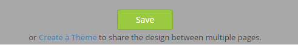
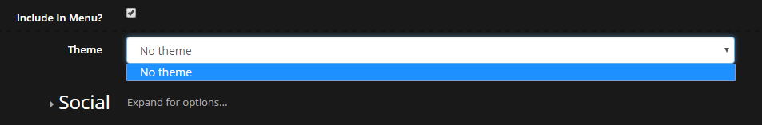
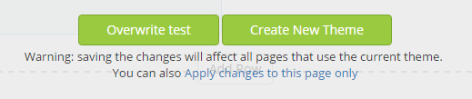
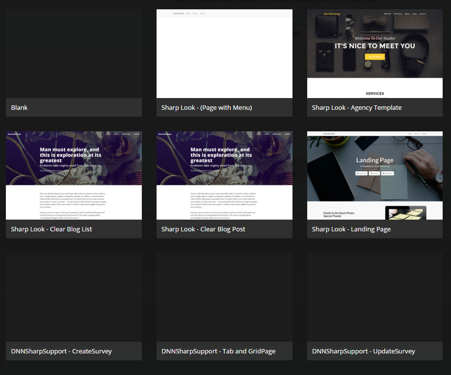
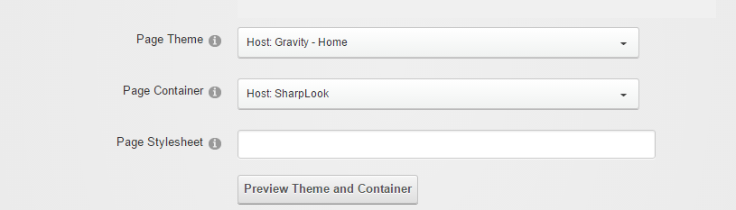

# Themes

Summary
by default, layout and design are saved per page in DB - this means they only applied to that particular page
templates are the standard DNN ascx skins
settings can also be saved as a standard DNN template and reused between pages or DNN instance
save template per portal or per host
templates can be changed back later so they are customized per page
Themes per Portal/per Host

A theme is useful for when you need to reuse the design between pages and to ease the work by just using it directly on Create Page action. On the Layout and Design mode whenever you make a change, the Save button will be displayed at the bottom of the page along with the Create Theme button which will save the customized page as a DNN skin and once clicked you'll have the possibility to choose where to save it, either per Portal or per Host and to label it. These DNN skins are saved per portal or per host without content, only the design and the layout of the page is saved. The themes are saved as .ascx files and they are created on disk as follows: the ones saved per Host under \Portals\<Home Folder>\Skins\SharpLook and are global and can be used on all portals, and the ones saved per Portal are saved under \Portals\<Portal>\Skin\SharpLook. 

If you access Page Settings option, either when you create a new page or when you want to modify an existing one, you can find the themes listed in the Theme drop down list, or you can find it on Advanced Settings page on the Page Skin drop down list, once the Advanced button is clicked, you'll be redirected to the custom DNN Page Settings page where you can access the Advanced Setting and change the Page skin to the theme previously customized. The theme file can be manually copied on other sites and used when creating new pages and, optionally customized differently per page. 

Whenever a modification will be made on the page which was saved as template, another set of buttons will be displayed, asking if you want to Overwrite the template, if you want to Save on this page or Save as New Theme.

How to use the Themes

After you've created a theme, if you need to use it on different other pages, you have to access the Control Panel page (click on the cogwheel icon first icon from the Admin Menu), then click on Page Settings and select the previously created theme from the Theme drop down list, click on Update Page button and the theme should be correctly set on the page.
  
Page Templates 

When we talk about page templates, we refer to the pages created on export action. The page templates can be found on File management > Templates and they differ from the themes saved per Portal/Host in terms of content, the page exported will keep the design along with the content.

In order to use the template you have to Export the page then:

1. on a page with Sharp Look skin access Control Panel page and click on Import Page button and select from the templates displayed:

2. when you create a new page in the old DNN interface, select the template previously saved and then in Advanced Settings set the skin to Sharp Look > click on Add page button:

