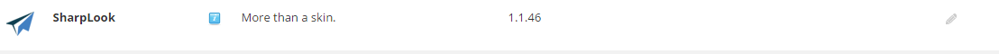

# Uninstalling Sharp Look

As you already know Sharp Look is a skin and it can be safely uninstalled just like any other skin or module. The only condition before proceeding with the uninstall process is to remove Sharp Look from the pages where it is set as a skin or delete those pages entirely. As you can see in the screenshot below, you can't uninstall it if it's on at least one page, because the bin pictogram is not visible:




After you remove Sharp Look from all pages the bin pictogram becomes visible and it can safely be uninstalled:


You can find the Sharp Look skin under Host - Extensions, click on "Themes" in order to open the drop-down with the list of skins.

If you're not sure on what pages you use Sharp Look skin or if the "bin" button does not show up then go to Host - SQL and run the following Query:

```select * 
  from tabs
  where SkinSrc like '%sharp%'
  or ContainerSrc like '%sharp%'```
  
  This will search the database for the keyword "sharp" and it will display a list with pages and portals where Sharp Look is being used.