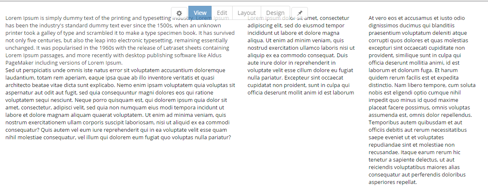

# View Mode

### Summary

* see exactly what non-admin users see
 
 
View mode is for end users; the page displays the content with the module editing tools hidden, the way the page appears to site visitors. Being responsive, users will get to see it nicely on all mobile devices as well as on PC, in all sizes, on all browsers.

